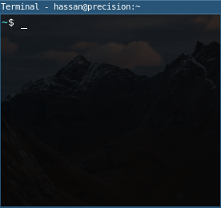

## Overview

This package will make prayer times available, up-to-date and accessible on your system directly from the Moroccan Ministry of Habous website.

## Usage

> Additionally raw prayer times are stored locally for reuse by other programs in your user data directory  

## Requirements

Python 3.10+

## Installation

* `pip install git+https://github.com/helanabi/wuqut.git@0.2.0`

> Use `pipx` for user-level installation (doesn't require root access)
> Use your system job scheduler to run `wuqut-dl` daily

## Configuration

* GNU/Linux users using systemd as their init system can use the example service/timer configuration files to auto-update data daily at 5:00 AM. For example:
  - `cp wuqut.service wuqut.timer ~/.config/systemd/user/`
  - `systemctl --user enable wuqut.timer`

> If you don't know what your init system is, you most likely are using systemd
> To confirm, run: `ps c -ocmd= 1`

* Change the URL parameter `ville` to match your city ID. If you don't know what your city ID is, open the URL in your browser, use the dropdown box to select your city, the URL will change to reflect your city's ID, that's what you should use as an argument to `wuqut-dl`.

## Storage

By default, data is stored as `data.csv` in the user's data directory. The following table defines data directories for each supported platform:

| Platform  | Path                                  |
|:----------|:--------------------------------------|
| GNU/Linux | `~/.local/share/wuqut`                |
| macOS     | `~/Library/Application Support/wuqut` |
| Android   | `/data/data/<pkg>/files/wuqut`        |
| Windows   | `C:\Users\<User>\AppData\Local\wuqut` |

## Future Improvements

- Store monthly prayer times

## LICENSE

This project is licensed under the GNU General Public License v3.0 or later.  
See the COPYING file for details.
